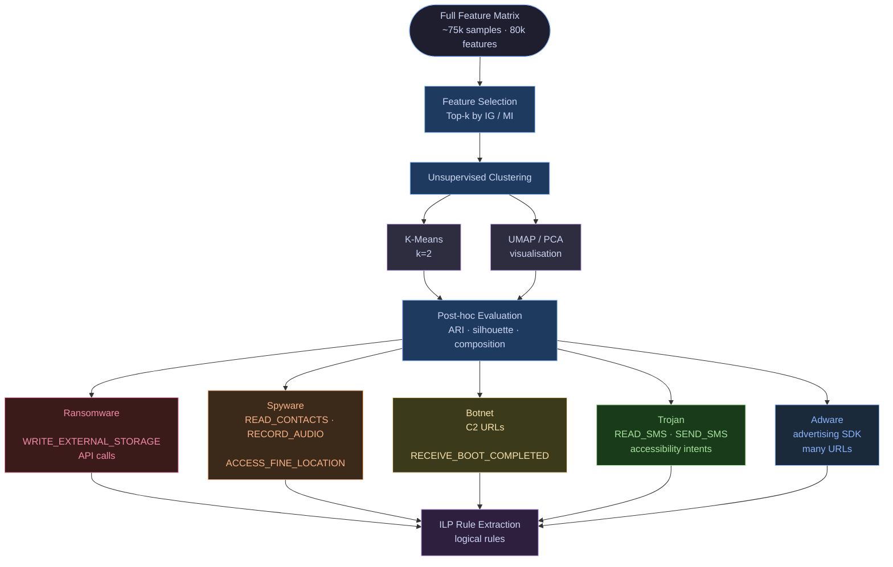

# Feature-Selection-with-ILP
Study of the feasibility of Inductive Logic Programming for Feature Selection in Malware Datasets

## Malware Types and Distinguishing Features

The following table summarises common malware families, their typical behaviour, and the types of features commonly used by machine learning systems to detect them.

| Malware Type | Typical Behaviour | Distinguishing Features |
|---|---|---|
| Virus | Attaches itself to legitimate executable files and spreads when the infected program is executed | Byte sequences, opcode patterns, executable header modifications, anomalies in file structure |
| Worm | Self-propagates automatically across networks without requiring user interaction | Network traffic patterns, repeated connection attempts, network-related system calls |
| Trojan | Disguises itself as legitimate software while executing hidden malicious functionality | Suspicious API calls, privilege escalation behaviour, hidden payload execution |
| Spyware | Collects sensitive information from the user and transmits it to remote servers | Access to user files or input devices, monitoring behaviour, network exfiltration patterns |
| Ransomware | Encrypts files on the victim machine and demands payment to restore access | High entropy in files, intensive file system operations, cryptographic API calls |
| Rootkit | Hides malicious processes and maintains privileged access to the system | Kernel API manipulation, system call interception, abnormal memory behaviour |
| Adware | Displays intrusive advertisements and may collect user browsing data | Frequent network communication, advertising-related API calls, tracking behaviour |
| Botnet Malware | Connects infected machines to a command-and-control infrastructure for remote control | Command-and-control communication patterns, remote command execution behaviour, abnormal network traffic |

## Unsupervised Malware Clustering Workflow

Since the dataset only contains binary labels (malware / goodware), we propose an **unsupervised clustering approach** to discover latent malware behaviour patterns without relying on class labels. The discovered clusters are then used as structured input for **Inductive Logic Programming (ILP)** to extract interpretable logical rules.

### Motivation

The DREBIN feature set captures rich behavioural signals (permissions, API calls, suspicious calls, URLs, etc.) that inherently reflect malware family behaviour. Even without family-level labels, these signals are sufficient to group samples by behaviour and extract logical rules.

### Workflow Overview

### Evaluation Strategy

| Metric | Purpose |
|---|---|
| **Silhouette Score** | Measures cluster cohesion and separation |
| **Adjusted Rand Index (ARI)** | Post-hoc alignment with true binary labels |
| **Cluster Composition** | Proportion of malware/goodware per cluster |
| **Feature Discriminativity** | Mean feature difference between clusters → ILP input |

### Key Insight

> The binary label (malware/goodware) is **never used during clustering**. If the resulting clusters align well with the true labels (high ARI), it confirms that the **Top-200 DREBIN features capture genuine behavioural structure**, validating both the feature selection step and the subsequent ILP rule extraction.
